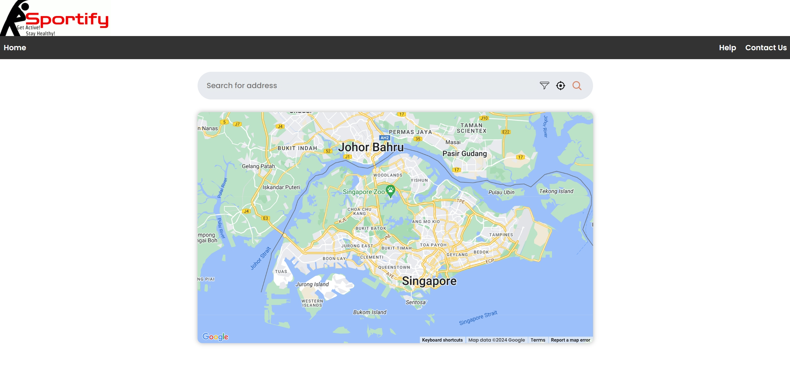

# Sportify


## Screenshot



## Project Description
In alignment with Singapore's Smart Nation Movement, Sportify is an innovative application designed to revolutionize the way individuals engage in fitness activities, directly catering to people who are interested in keeping fit in Singapore.\
Sportify aims to leverage publicly available government data to promote an active lifestyle by providing users with real-time information on weather conditions, and transportation options for sports locations.\
By offering recommendations, Sportify seeks to enhance user convenience and promote regular exercise.
## Set Up Instruction

#### Skeleton

- Front-end framework: React
- Back-end framework: Firebase (BaaS)

The project directory is under the [./sportify](./sportify) folder. In order to run the project, you need to run the following commands:

1. Clone the repository:

   ```powershell
   git clone https://github.com/keenlim/SC2006-Project.git
   ```

2. Go to the project directory:

   ```powershell
   cd sportify
   ```

3. Install dependencies (need to force installation):

   ```powershell
   npm install --force
   ```

4. Start the app in the development mode:

   ```powershell
   npm start
   ```

## Web App Demo

[Click here to see the demo!](https://youtu.be/couJMGCY0mY)

## Contributors

<a href="https://github.com/softwarelab3/2006-SCEC-Haagen-Daz/graphs/contributors">
  
</a>

